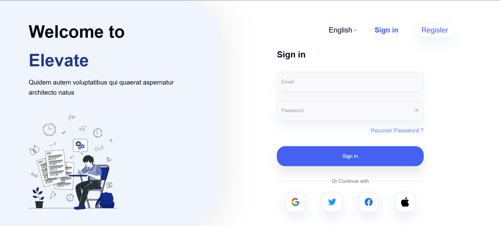

# Online Exam Platform - Elevate

A modern, scalable online examination platform built with Next.js, designed to provide a seamless experience for both students and educators.




## 🚀 Features

- **Modern Authentication System**

  - Secure login and registration
  - Role-based access control
  - Session management

- **Interactive Dashboard**

  - Real-time exam progress tracking
  - Performance analytics
  - Subject-wise organization

- **Exam Management**

  - Create and manage exams
  - Question bank management
  - Automatic grading system

- **User Experience**
  - Responsive design
  - Dark/Light mode support
  - Intuitive navigation

## 📋 Prerequisites

Before you begin, ensure you have the following installed:

- Node.js (v18 or higher)
- Yarn package manager
- Git

## 🛠️ Installation

1. **Clone the repository**

   ```bash
   git clone [your-repository-url]
   cd online-exam-elevate
   ```

2. **Install dependencies**

   ```bash
   yarn install
   ```

3. **Set up environment variables**
   Create a `.env.local` file in the root directory with the following variables:

   ```
   NEXT_PUBLIC_API_URL=your_api_url
   NEXTAUTH_SECRET=your_secret_key
   NEXTAUTH_URL=http://localhost:3000
   ```

4. **Start the development server**
   ```bash
   yarn dev
   ```

## 🏗️ Project Structure

```
src/
├── app/                 # Next.js app router
│   ├── (routes)/       # Main application routes
│   │   ├── (dashboard)/# Dashboard features
│   │   ├── auth/       # Authentication pages
│   │   └── [...rest]/  # Catch-all routes
│   └── api/            # API routes
├── components/         # Reusable UI components
├── lib/               # Utility functions and configurations
└── styles/            # Global styles and Tailwind configuration
```

## 🧩 Key Technologies

- **Frontend Framework**: Next.js 14
- **Language**: TypeScript
- **Styling**: Tailwind CSS
- **State Management**: React Query
- **UI Components**: ShadeCn
- **Form Handling**: React Hook Form + Zod
- **Authentication**: NextAuth.js

## 🧪 Testing

```bash
# Run tests
yarn test

# Run tests in watch mode
yarn test:watch
```

## 📦 Build & Deployment

```bash
# Build for production
yarn build

# Start production server
yarn start
```

## 🤝 Contributing

1. Fork the repository
2. Create your feature branch (`git checkout -b feature/AmazingFeature`)
3. Commit your changes (`git commit -m 'Add some AmazingFeature'`)
4. Push to the branch (`git push origin feature/AmazingFeature`)
5. Open a Pull Request

## 📄 License

This project is licensed under the MIT License - see the [LICENSE](LICENSE) file for details.

## 📞 Support

For support, email [ziadzzamel@gmail.com] or join our Slack channel.

## 🙏 Acknowledgments

- [Next.js Documentation](https://nextjs.org/docs)
- [Tailwind CSS Documentation](https://tailwindcss.com/docs)
- [React Query Documentation](https://tanstack.com/query/latest)
